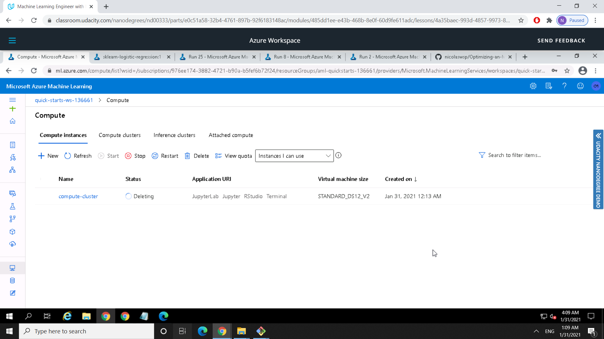

# Optimizing an ML Pipeline in Azure

## Overview
This project is part of the Udacity Azure ML Nanodegree.
In this project, we build and optimize an Azure ML pipeline using the Python SDK and a provided Scikit-learn model.
This model is then compared to an Azure AutoML run.

## Summary
This dataset contains data related with direct marketing campaigns of a Portuguese banking institution. The marketing campaigns were based on phone calls.  The classification goal is to predict if the client will subscribe (yes/no) a term deposit (variable y). (Moro et al., 2014)

You can access the dataset through the following link:
https://archive.ics.uci.edu/ml/datasets/bank+marketing

It was ran two solutions, one consisting in a LogisticRegression model with scikit-learn using Azure HyperDrive and the other using Azure AutoML to find the best accuracy. 
The best perfomance model was the Azure AutoML run by millesimal differences. The accuracy obtained by the Azure AutoML was 0.91715 while by the Azure HyperDrive was 0.90872. The difference is 0.00843, a very small number. The best performing model was the VotingEnsemble. A voting ensemble works by combining the predictions from multiple models. It uses Soft Voting that predicts the class with the largest summed probability from models.

## Scikit-learn Pipeline

You can see the pipeline main steps that we followed in both approaches:

### Data preparation
The dataset in a csv file was converted to a TabularDataset type by using TabularDatasetFactory and then to a pandas dataframe. The dataframe was cleaned and tranformed applying One hot encoding. It was used the train_test_split method from scikit-learning to split 75% of data to the train set and 25% to the test set.

### Classifier
Logistic Regression from the Scikit-Learn library was chosen as algorithm to be tuned by the Azure HyperDrive.

### Hyperparameter tuning 
The hyperparameters tuned were the following:   
* C - Inverse of regularization strength
* max_iter - Maximum number of iterations taken for the solvers to converge

The hyperparameters search space was:  
* C: (0.01, 0.1, 1, 10, 100)  
* max_iter: (25, 50, 75, 100, 125, 150, 175, 200, 250, 300)

It was used the RandomParamaterSampler that supports both continuos and discrete values. Besides, it supports early termination of low-performance runs.
It picks randomly hyperparameter values, so in this case save some time getting an optimal primary metric in a short period.

The early termination policy chosen was Bandit Policy. It is an early termination policy based on slack factor/slack amount and evaluation interval. The policy early terminates any runs where the primary metric is not within the specified slack factor/slack amount with respect to the best performing training run. So, it avoids unnecessary processing.

## AutoML
The AutoConfig configuration in the same Notebook followed these steps:

* Created a dataset from the provided URL using TabularDatasetFactory in the notebook
* Splitted data into train and test sets
* Modified the AutoML config
* Submitted the AutoML run
* Saved the best model

The AutoML config was the following parameters:
* experiment_timeout_minutes=30  
  This is an exit criterion when the experiment time exceeds the time out established. This avoids to time out when occurs failures.
* task='classification'  
  This sets the type of experiment that is set to run, in this case was classification.
* primary_metric='accuracy'  
  This sets the primary metric that is used as parameters to choose the best model.
* label_column_name='y'  
  This criterion sets the dataset collumn that is aimed to be predicted.
* n_cross_validations=5  
  This parameter sets the number of cross validation to be performed while training the model. In this case was chosen 5 folds for cross-validation to avoid overfitting and generalize better the model. 

The best performing model was the VotingEnsemble among the several tested. Some of these models were LightGBM, Xgboost, ExtremeRandomTrees, StandardScalerWrapper, RandomForest. A voting ensemble works by combining the predictions from multiple models. It uses Soft Voting that predicts the class with the largest summed probability from models.

## Pipeline comparison
The best perfomance model was the Azure AutoML run by millesimal differences. The accuracy obtained by the Azure AutoML was 0.91715 while by the Azure HyperDrive was 0.90872. The difference is 0.00843, a very small number. The difference in performance can be explained due to the several algorithms that were trained in the AutoML run, using emsembles that are usually more powerful than a single algorithm. Another reasons are that the AutoML run performs feature engineering and chooses hyperparameters, differently from the Hyperdrive approach that works only with hyperparameters tunning.
In relation to the architecture, AutoML has some clear benefits that is saving resources and testing a broader scope of algorithms and perfomances.

## Future work
For future improvements there are some aspects that can be explored:

* It could be correted  the unbalanced data.
* Use more data to get more complex correlations.
* Explore different sampling methods to get better metric result.
* Explore different hyperparemters and ranges for an specific algorithm.

For the unbalenced data could be used some technique as undersampling, oversampling, VAE or SMOTE to resemble the dataset. It could be collected more data from the minority class. Some metrics work better with unbalanced data for example F1-score, AUC.  
All of these implementations could result in better model performance and allows a different result interpretability.

## Proof of cluster clean up
Image of cluster marked for deletion

